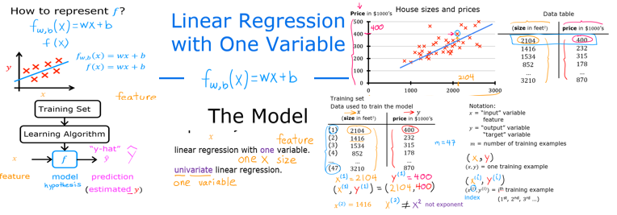

## Machine Learning Algorithms
- Supervised learning
- Unsupervised learning
- Reinforcement Learning
- Advice for applying learning algorithms

---

###  Supervised Learning Algorithms
- Learn to predict input/output or X/Y mapping
- Maps input x to output y, where the learning algorithms learn from "right answers"

### 2 Major Types of Supervised Learning Algorithms

#### Regression Learning Algorithms
- Predict a number infinitely many possible outputs
  - Example: 
    - predict prices in houses 

#### Classification Learning Algorithm
- predict small number of possible outputs like 0 and 1
- predict categories
  - Example:
    - can predict if picture is cat/dog
    - 1 or 0

---

### Unsupervised Learning
- Data only comes with inputs x, but not output labels y. 
- Algorithm has to find "structure" in the data.

#### Clustering
- Group similar data points together.

### Dimensionality reduction
- Compress data using fewer numbers.

### Anomaly Detection
- Find unusual data points.

----

### Linear Regression Model
- filling a straight line into your data

#### Terminologies
- Training Set -> data used to train the model
- Notation 
  - x = "input" variable feature
  - y = "output" or "target" variable
  - m = total number of training examples
  - (x,y) = single training example
  - (x^(i) ,  y^(i)) = ith training example
    - index not exponent

----

### Sample Lab
- Process on how "Supervised Learning" works
- input a "data set"

- training set 
  - features
  - targets

- Feed the training model with input/output targets
- Then the supervised learning algorithm will produce some "function" (f)
- Function (f) -> Hypothesis

x  ->   f    -> y "y-hat"

- function f is the model
- x is the input feature
- ŷ is the prediction or the output (estimated y)
- model prediction is the estimated value of y
- y is the target

#### How to represent function f?

- $$= f_w,b(x) = wx + b $$
- f(x) 
- f(x) = wx + b
  - linear function
  - Linear regression with one variable
  - Univariate linear regression

